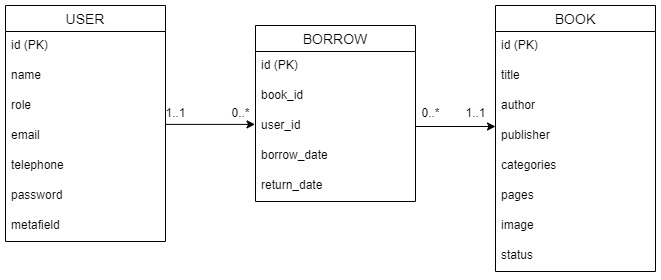
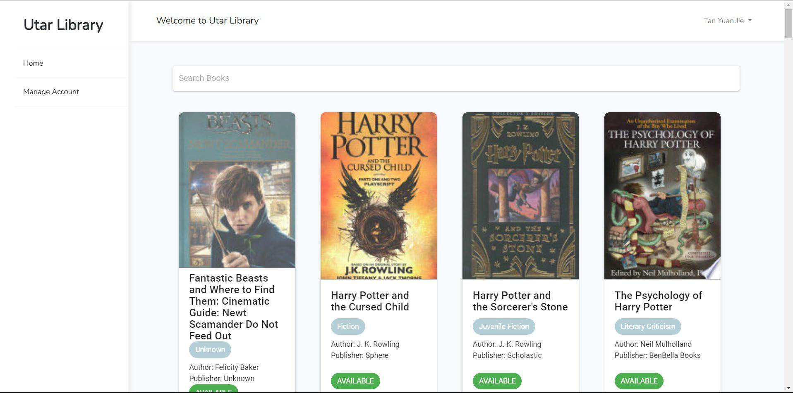
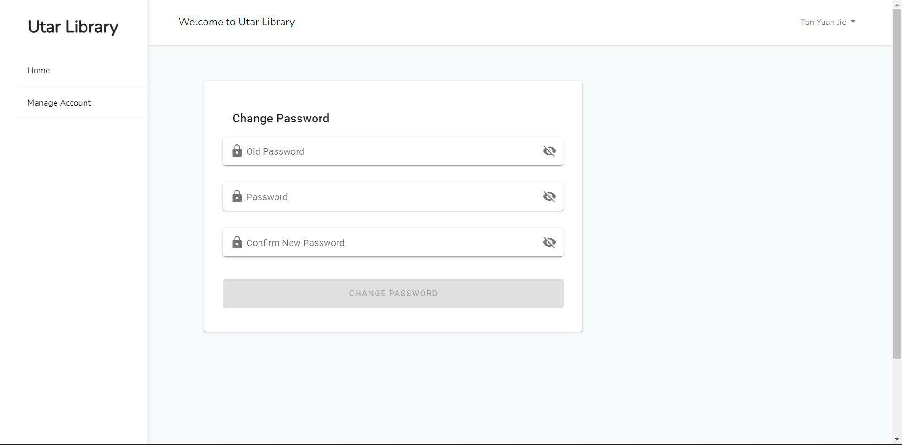
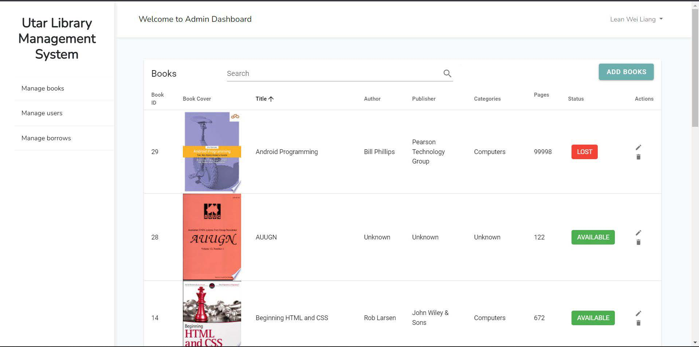
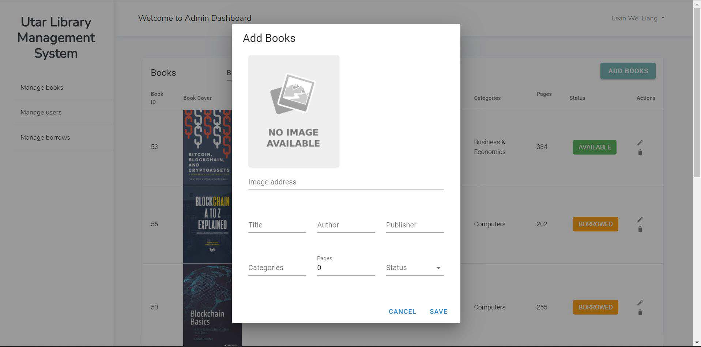
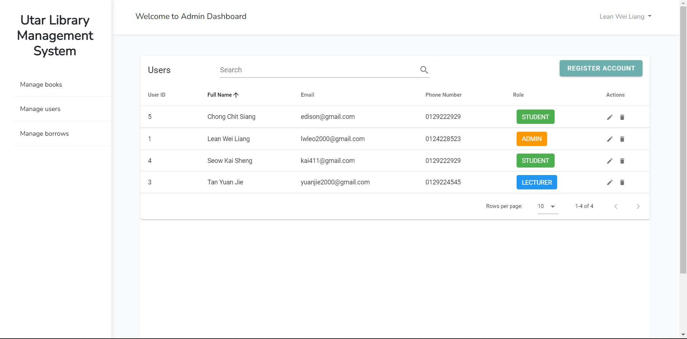
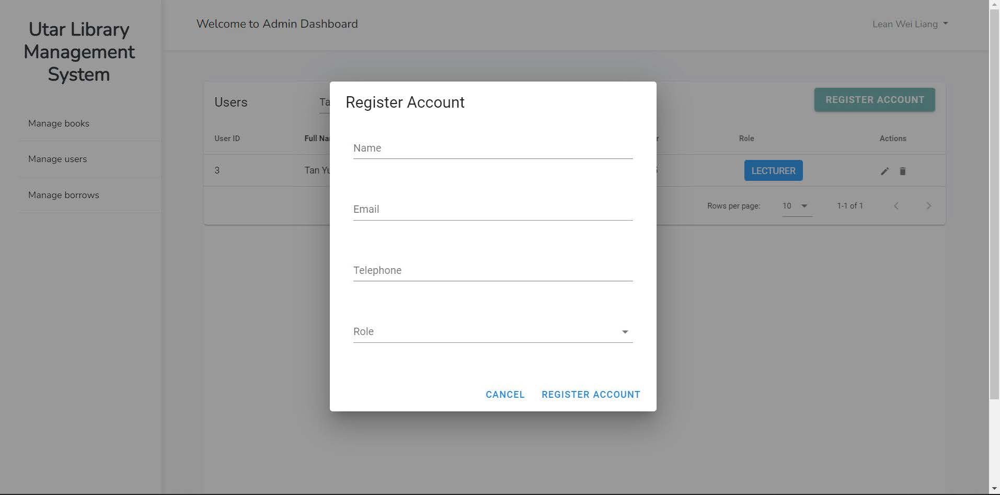
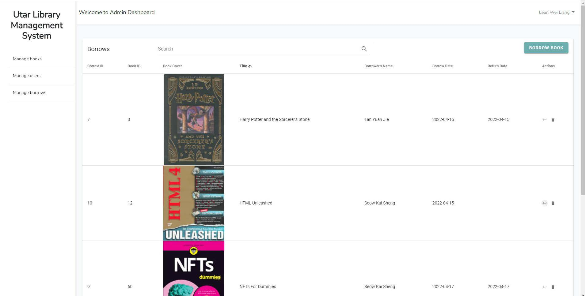
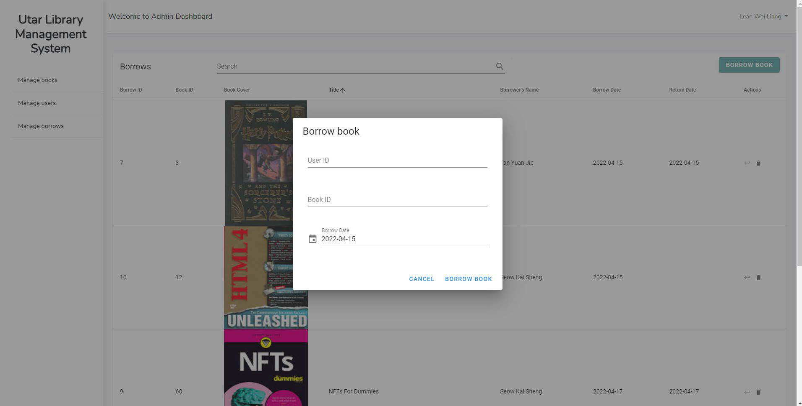
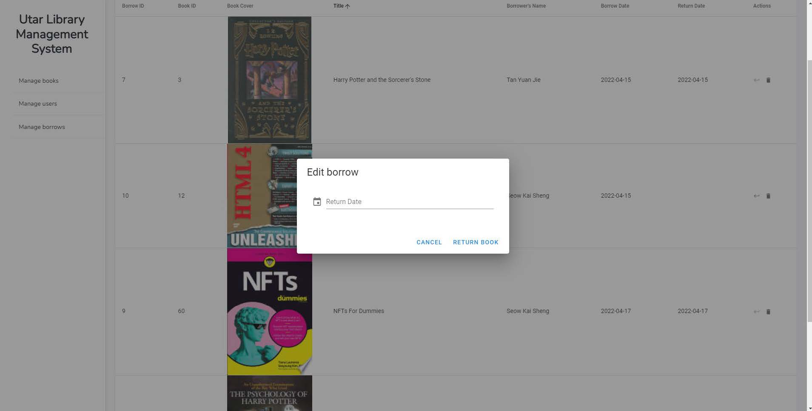

# University Library Management System
<!-- ALL-CONTRIBUTORS-BADGE:START - Do not remove or modify this section -->
[](#contributors-)
<!-- ALL-CONTRIBUTORS-BADGE:END -->

## Overview

This is a library system designed for internal use by the university. There are three end users exist in the system: admin, student and lecturer. This project focuses on the authentication and authorization concepts. There are two roles in the system: admin and users, which have different permissions.

## Features

1. Login<br>
   The admin and user can login to the system by entering valid email and password.

### Admin

2. Book Management<br>
   The admin can view a list of books, add, edit and delete the book records. Besides, the admin can also search the books by title.

3. User Management<br>
   The admin can view a list of all users with their role, register, edit and delete the user. Besides, the admin can also search the users by name.

4. Borrow Management<br>
   The admin can view a list of books borrowed by the users. Besides, the admin can also search for the books borrowed by title. In addition, the admin can perform book borrowing and returning. If any of the users want to borrow the books, they would require to approach admin so that admin can create book borrowing record.

## Tech Stack

-   [Laravel (PHP)](https://laravel.com/)
-   [Vue](https://vuejs.org/)
-   [MySQL (PhpMyAdmin)](https://www.phpmyadmin.net/)
-   [Figma](https://www.figma.com/)

## System Design

### Prototype Design

-   https://www.figma.com/file/8nGECPOkxag1lRCqsrfpzE/Untitled?node-id=0%3A1

### ERD

<br>

## Installation

### Prerequisites

-   [PHP^8.0.2](https://www.php.net/downloads.php)
-   [Composer](https://getcomposer.org/)
-   [phpMyAdmin](https://www.phpmyadmin.net/)

### Installation Steps

1. Install the composer packages using composer.
    ```
     composer install
    ```
2. Install the frontend packages using npm.
    ```
    npm i
    ```
3. Create .env to configure environment variables as follows:

    ```
    APP_NAME=Laravel
    APP_ENV=local
    APP_KEY=
    APP_DEBUG=true
    APP_URL="http://localhost"
    LOG_CHANNEL=stack
    LOG_DEPRECATIONS_CHANNEL=null
    LOG_LEVEL=debug
    DB_CONNECTION=mysql
    DB_HOST=127.0.0.1
    DB_PORT=3306
    DB_DATABASE="university_library_management_system"
    DB_USERNAME=root
    DB_PASSWORD=
    BROADCAST_DRIVER=log
    CACHE_DRIVER=file
    FILESYSTEM_DISK=local
    QUEUE_CONNECTION=sync
    SESSION_DRIVER=file
    SESSION_LIFETIME=120
    MEMCACHED_HOST=127.0.0.1
    REDIS_HOST=127.0.0.1
    REDIS_PASSWORD=null
    REDIS_PORT=6379
    MAIL_MAILER=smtp
    MAIL_HOST=mailhog
    MAIL_PORT=1025
    MAIL_USERNAME=null
    MAIL_PASSWORD=null
    MAIL_ENCRYPTION=null
    MAIL_FROM_ADDRESS="hello@example.com"
    MAIL_FROM_NAME="${APP_NAME}"
    AWS_ACCESS_KEY_ID=
    AWS_SECRET_ACCESS_KEY=
    AWS_DEFAULT_REGION=us-east-1
    AWS_BUCKET=
    AWS_USE_PATH_STYLE_ENDPOINT=false
    PUSHER_APP_ID=
    PUSHER_APP_KEY=
    PUSHER_APP_SECRET=
    PUSHER_APP_CLUSTER=mt1
    MIX_PUSHER_APP_KEY="${PUSHER_APP_KEY}"
    MIX_PUSHER_APP_CLUSTER="${PUSHER_APP_CLUSTER}"
    ```

4. Create a MySQL database with the following details:
    ```
    DB_CONNECTION=mysql
    DB_HOST=127.0.0.1
    DB_PORT=3306
    DB_DATABASE="university_library_management_system"
    DB_USERNAME=root
    DB_PASSWORD=
    collation=utf8mb4_unicode_ci
    ```
5. Import `university_library.sql` into the database created.
6. Generate an application encryption key.
    ```
    php artisan key:generate
    ```
7. Build the application with the following command:
    ```
    npm run dev
    ```
8. Run the server.
    ```
    php artisan serve
    ```

## Login Credentials

If you imported the university_library.sql, the login credentials are as follows:
| Email                 | Password   | Role     |
|-----------------------|------------|----------|
| lwleo2000@gmail.com   | 0124228523 | Admin    |
| yuanjie2000@gmail.com | 0129224545 | Lecturer |
| kai411@gmail.com      | 0129222929 | Student  |
| edison@gmail.com      | 0129222929 | Student  |
| aliabuakao@gmail.com  | 0123456789 | Student  |


## Preview

1. Login <br> <br><br>
2. Home Page (Student and Lecturer) <br> <br><br>
3. Change Password <br> <br><br>
4. Book Management <br> <br><br>
5. Add Book <br> <br><br>
6. User Management <br> <br><br>
7. Register Account <br> <br><br>
8. Borrow Management <br> <br><br>
9. Borrow Book <br> <br><br>
10. Return Book <br> <br><br>
## Contributors ✨

Thanks goes to these wonderful people ([emoji key](https://allcontributors.org/docs/en/emoji-key)):

<!-- ALL-CONTRIBUTORS-LIST:START - Do not remove or modify this section -->
<!-- prettier-ignore-start -->
<!-- markdownlint-disable -->
<table>
  <tr>
    <td align="center"><a href="https://github.com/IQ9999999"><br /><sub><b>IQ9999999</b></sub></a><br /><a href="https://github.com/IQ9999999/University-Library-Management-System/commits?author=IQ9999999" title="Code">💻</a> <a href="https://github.com/IQ9999999/University-Library-Management-System/commits?author=IQ9999999" title="Documentation">📖</a> <a href="#ideas-IQ9999999" title="Ideas, Planning, & Feedback">🤔</a> <a href="#infra-IQ9999999" title="Infrastructure (Hosting, Build-Tools, etc)">🚇</a></td>
    <td align="center"><a href="https://github.com/lwleo02"><br /><sub><b>lwleo02</b></sub></a><br /><a href="#question-lwleo02" title="Answering Questions">💬</a> <a href="https://github.com/IQ9999999/University-Library-Management-System/commits?author=lwleo02" title="Code">💻</a> <a href="#data-lwleo02" title="Data">🔣</a> <a href="https://github.com/IQ9999999/University-Library-Management-System/commits?author=lwleo02" title="Documentation">📖</a> <a href="#ideas-lwleo02" title="Ideas, Planning, & Feedback">🤔</a> <a href="https://github.com/IQ9999999/University-Library-Management-System/pulls?q=is%3Apr+reviewed-by%3Alwleo02" title="Reviewed Pull Requests">👀</a></td>
    <td align="center"><a href="https://github.com/yuanjie8629"><br /><sub><b>Tan Yuan Jie</b></sub></a><br /><a href="https://github.com/IQ9999999/University-Library-Management-System/issues?q=author%3Ayuanjie8629" title="Bug reports">🐛</a> <a href="https://github.com/IQ9999999/University-Library-Management-System/commits?author=yuanjie8629" title="Code">💻</a> <a href="https://github.com/IQ9999999/University-Library-Management-System/commits?author=yuanjie8629" title="Documentation">📖</a> <a href="#ideas-yuanjie8629" title="Ideas, Planning, & Feedback">🤔</a> <a href="https://github.com/IQ9999999/University-Library-Management-System/commits?author=yuanjie8629" title="Tests">⚠️</a> <a href="#userTesting-yuanjie8629" title="User Testing">📓</a></td>
    <td align="center"><a href="https://github.com/Kai411"><br /><sub><b>kaii411</b></sub></a><br /><a href="https://github.com/IQ9999999/University-Library-Management-System/commits?author=Kai411" title="Code">💻</a> <a href="#design-Kai411" title="Design">🎨</a> <a href="https://github.com/IQ9999999/University-Library-Management-System/commits?author=Kai411" title="Documentation">📖</a> <a href="#ideas-Kai411" title="Ideas, Planning, & Feedback">🤔</a> <a href="#userTesting-Kai411" title="User Testing">📓</a></td>
  </tr>
</table>

<!-- markdownlint-restore -->
<!-- prettier-ignore-end -->

<!-- ALL-CONTRIBUTORS-LIST:END -->

This project follows the [all-contributors](https://github.com/all-contributors/all-contributors) specification. Contributions of any kind welcome!